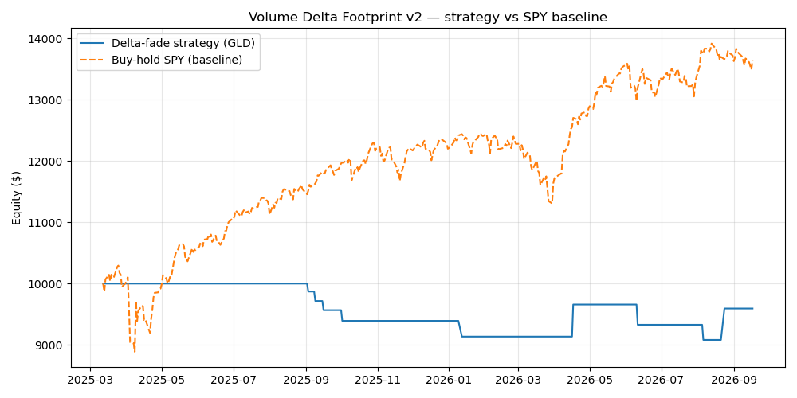

# Volume-Delta Footprint Backtest (v2)

A Python backtest faithful to Zeiierman's
[Volume Delta Footprint Map](https://www.tradingview.com/script/7vcb6M4J-Volume-Delta-Footprint-Map-Zeiierman/)
(TradingView, Pine Script) — author's assets, author's timeframe mapping,
author's default parameters.

## Author's setup, mirrored

- **Asset**: the author's demo screenshots are XAUUSD / BCOUSD / NAS100USD
  (OANDA CFDs). We trade **GLD** as the XAUUSD (spot gold) proxy — no futures
  rolls, clean 2-year hourly history.
- **Timeframes**: daily chart bars; the author's auto lower-timeframe mapping
  selects **60m** as the LTF for daily charts. Delta inside each daily bar =
  sum of signed hourly volume (bullish hour +, bearish hour −), exactly the
  author's documented estimation rule.
- **Parameters** (author defaults): delta persistence EMA(12), minimum stripe
  strength 0.12, lookback 120 bars.
- **Signal** ("Find Trapped Buyers and Sellers" from the script's docs):
  strong positive delta + rejection at 20-day swing high → SHORT;
  strong negative delta + rejection at 20-day swing low → LONG.
- **Risk**: 1.5×ATR(14) stop, 3×ATR target, max 10 trading days hold.
  $10k notional per trade, one position at a time, no leverage.
- **Baseline** (repo AGENT.md rule): buy-and-hold SPY over the exact same
  dates, dividends included.

## Results (2y hourly data → 382 daily bars, 2025-03-12 → 2026-09-17)

| Metric | Strategy (GLD delta-fade) | Baseline: SPY buy & hold |
|---|---|---|
| Total return | −4.06% | +36.46% |
| Excess return | −40.52% | — |
| Trades | 9 (win rate 22%, profit factor 0.76) | — |
| Max drawdown | −9.18% | — |
| GLD buy & hold (ref) | +47.33% | — |

The strategy lost money while gold itself rose 47% and SPY 36%: fading
"trapped" traders through a 2-year gold bull market means catching falling
knives. The honest read is that the author's tool is for **reading buying /
selling pressure at key levels to assist timing** — not a standalone
mean-reversion system, and especially not in a trending market.

Limitations: delta is estimated from hourly candle direction, not exchange
bid/ask ticks (the author is upfront about this too); 9 trades is still a
small sample; no fees/slippage modeled.



## Run it

Data is saved on disk — no re-download needed:

```bash
pip install -r requirements.txt
python backtest.py        # reads data/*.csv, writes results.csv + assets/equity.png
python download_data.py   # re-download 2y hourly bars from yfinance (optional)
```

## Files

- `backtest.py` — delta computation, strategy, metrics, charts (reads local data)
- `download_data.py` — one-time yfinance download → `data/`
- `data/GLD_1h.csv`, `data/SPY_1h.csv` — 2 years of hourly bars, saved
- `results.csv` — metrics table from the last run
- `assets/equity.png` — equity curve vs SPY baseline

## Disclaimer

Educational purposes only. Not financial advice. Past performance does not
guarantee future results.
