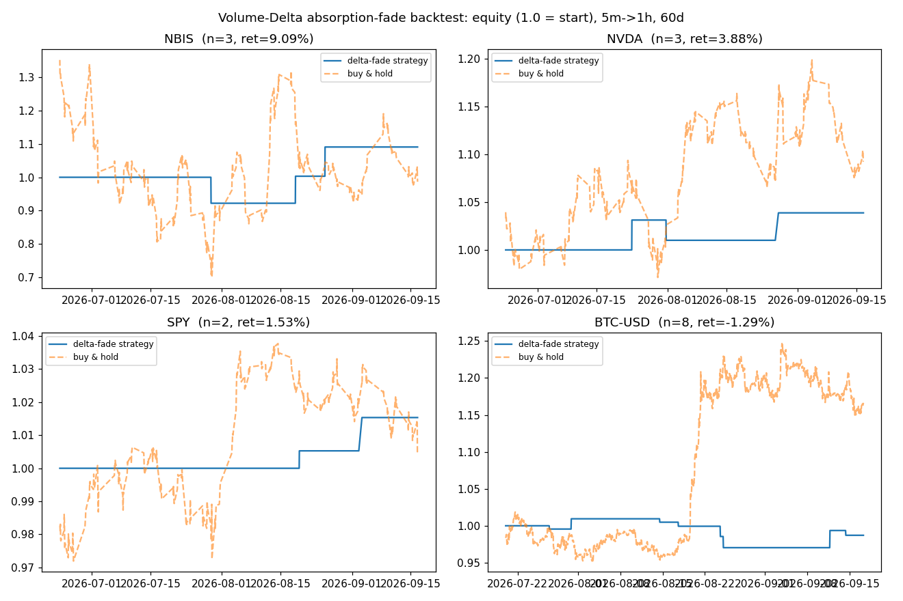

# Volume-Delta Footprint Backtest

Python backtest inspired by Zeiierman's
[Volume Delta Footprint Map](https://www.tradingview.com/script/7vcb6M4J-Volume-Delta-Footprint-Map-Zeiierman/)
— the `.pine` source and notes for that indicator live in
`tradingview-pine-scripts/`.

## Method

- **Lower-timeframe delta**: inside each 1H candle, sum signed 5-minute candle
  volume (+volume for bullish candles, −volume for bearish ones).
- **Delta persistence**: EMA of the hourly delta (exponential decay).
- **Signal** ("trapped buyers/sellers"): extreme delta z-score (|z| > 1.25)
  + new 24-bar high/low + rejection candle → fade the move.
- **Exits**: 1.5×ATR stop, 3×ATR target, max hold 24 bars, or opposite signal.

## Results (60 days of 5m data, $10k notional/trade, no leverage)

| Asset   | Trades | Win rate | Strategy | Buy & hold | Profit factor | Max DD |
|---------|--------|----------|----------|------------|---------------|--------|
| NBIS    | 3      | 67%      | +9.1%    | −1.3%      | 2.17          | −7.8%  |
| NVDA    | 3      | 67%      | +3.9%    | +9.3%      | 2.83          | −2.1%  |
| SPY     | 2      | 100%     | +1.5%    | +0.5%      | —             | 0%     |
| BTC-USD | 8      | 25%      | −1.3%    | +16.6%     | 0.74          | −3.9%  |

Small sample (2–8 trades): proof of concept, not a conclusion. No
fees/slippage modeled. Delta is approximated from candle direction, not
exchange bid/ask data.



## Run it

```bash
pip install yfinance pandas numpy matplotlib
python backtest.py
```

Educational purposes only — not financial advice.
