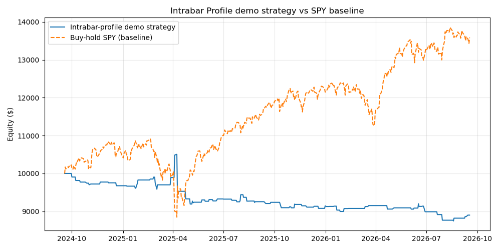
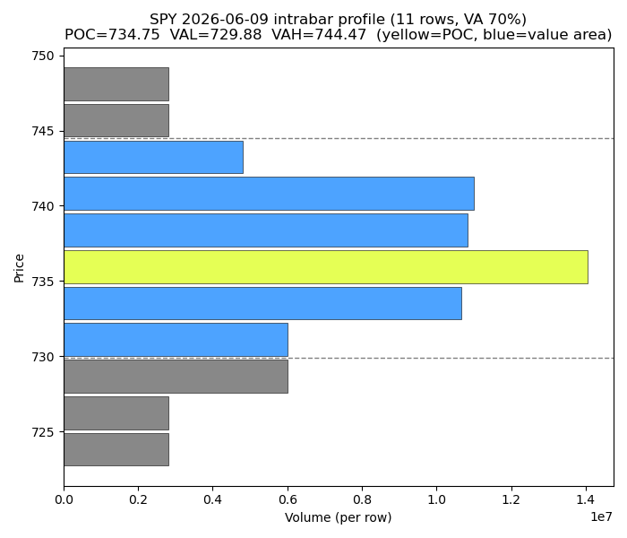

# Intrabar Profile 研读与回测

对 KioseffTrading 的 TradingView 开源脚本
[Intrabar Profile](https://www.tradingview.com/script/j38vuAvW-Intrabar-Profile-Kioseff-Trading/)
(Pine v6, MPL 2.0) 的研读：Python 逐行复刻其 intrabar profile 重建算法，
做逻辑验证(sanity check)，再基于 profile 构造一个演示策略回测。

## 作者算法，复刻要点

- 每根 chart bar 内用低级别(LTF)数据重建 volume profile / delta profile。
- `rows=11`(作者默认)：`Range=(high-low)/(rows-1)`，价格区间划分 11 档。
- 每根 LTF bar 的带符号成交量 `volume * sign(close 变化)`(tick 级用 bid/ask，
  这里用小时 K 方向近似)，按其 high-low 覆盖的档位平均分摊；
  `POC` = 成交量最大档；value area 从 POC 向两侧扩展直到覆盖 70% 总量。
- `backtest.py` 里的 `intrabar_profile()` 是对源码 `everyBarVP()` 的直译，
  包括 `binary_search_leftmost` 档位定位和 VA 扩展循环。

## 时间框架映射(诚实说明)

作者默认 granularity=1-Minute，适用于日内 chart。Yahoo 对 1m/5m 数据只保留
最近约 60 天，2 年跨度下可用的最小日内级别是 60m，因此本实验：
**chart=日线，LTF=60m**(与 volume-delta-footprint v2 的"日线→60m"映射一致)。
这意味着每根日线 bar 只有约 6.5 根小时线参与 profile 重建——profile 较稀疏，
结论只作演示，不宜外推到作者原生的 1 分钟粒度。

## 演示策略(规则写死，无未来函数)

信号在日线收盘产生，次日持有 1 天：

- 日收盘 > 当日 VAH(价值区上沿) → 次日做多(高于价值区被接受→动量延续)
- 日收盘 < 当日 VAL(价值区下沿) → 次日做空(低于价值区被接受→动量延续)
- 收盘落在价值区内 → 空仓

$10k 名义本金，一次一笔，无杠杆；**无手续费/滑点建模**。
Baseline(仓库 AGENT.md 规则)：同区间 SPY buy-and-hold。

## 结果(501 根日线，2024-09-18 → 2026-09-17)

| 指标 | 演示策略 | Baseline：SPY 买入持有 |
|---|---|---|
| 区间收益 | −10.98% | +35.87% |
| 超额收益(策略 − baseline) | −46.85% | — |
| 交易次数 | 80(胜率 48.75%，盈亏比 0.71) | — |
| 最大回撤 | −16.72% | — |
| 平均每笔 | −0.134% | — |

逻辑验证：501 根日线 profile 全部通过 sanity 检查
(vp 总量 == |带符号成交量| 之和，最大绝对误差 2.98e-08；
POC 为最大档；VA 覆盖 ≥70%；delta 符号守恒)。




解读：胜率接近抛硬币(48.75%)但盈亏比只有 0.71——"收盘站上价值区就追"
在 SPY 这种长期向上的标的上，两年里稳定地小亏。这也印证了作者在脚本说明
里的定位：**这是一个分析可视化工具，不是预测引擎**；单根 K 线的内部结构
不足以构成可独立运行的交易系统。

局限：delta 用小时 K 方向估算，不是真实 bid/ask tick；LTF 只有小时级，
与作者默认的 1 分钟粒度有差距；日线级别下 profile 稀疏；无费用滑点。

## 复现

数据已存盘，无需重新下载：

```bash
pip install yfinance pandas numpy matplotlib
python backtest.py        # 读 data/*.csv，写 results.csv + assets/*.png
python download_data.py   # 从 yfinance 重新下载 2 年小时线(可选)
```

## 文件

- `backtest.py` — profile 复刻、sanity 检查、演示策略、指标、作图(读本地数据)
- `download_data.py` — 一次性 yfinance 下载 → `data/`
- `data/SPY_1h.csv` — 2 年小时线(0.36MB)
- `results.csv` — 最近一次运行的指标表
- `assets/equity_curve.png` — 净值曲线 vs SPY baseline
- `assets/profile_example.png` — 某日 intrabar profile 重建示例
- `index.html` — 中文研读笔记(供 GitHub Pages)
- `intrabar-profile.pine` — 作者原源码存档(MPL 2.0，版权归 KioseffTrading)

## 免责

仅作学习交流，不构成投资建议。过往表现不代表未来收益。
